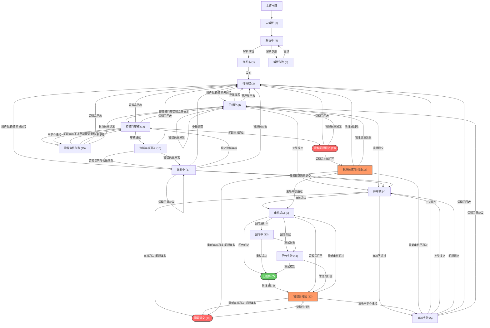
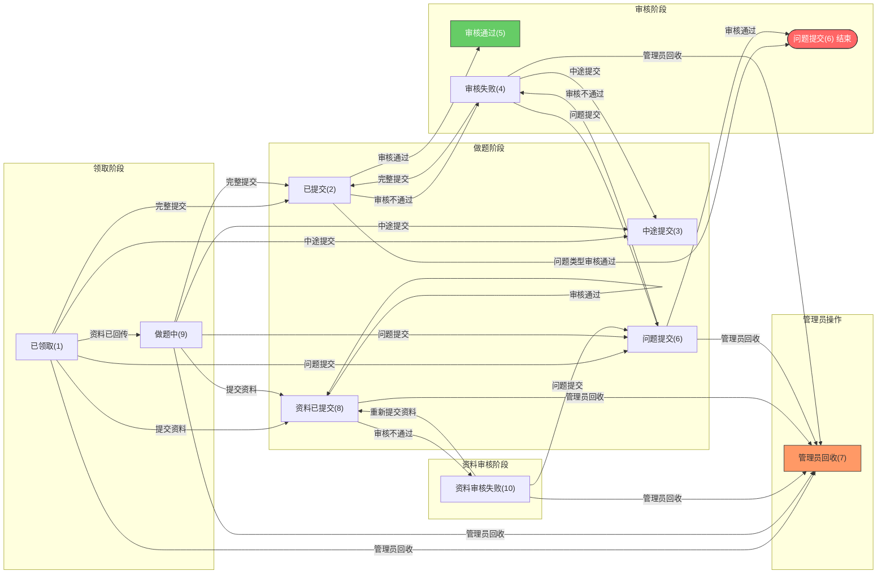
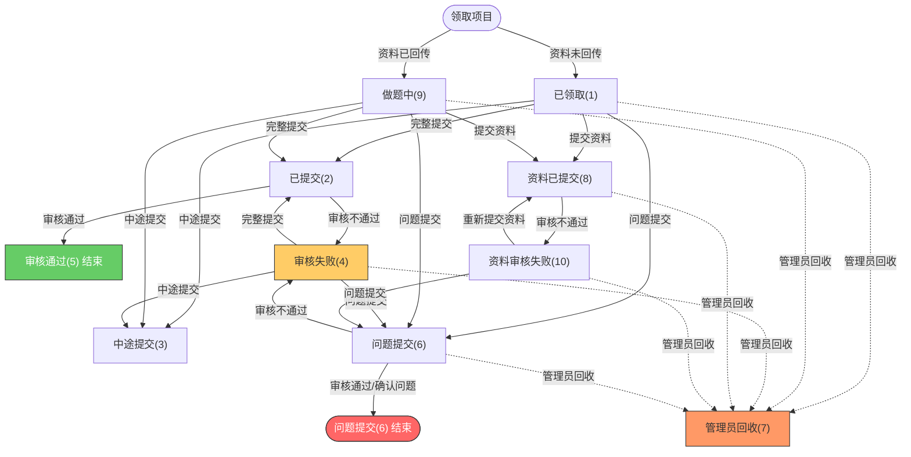

# 书籍项目状态流转说明

> **版本**: v3.0 | **日期**: 2026-06-14

---

## 一、角色定义

系统涉及以下角色：

| 角色 | 说明 | 典型操作 |
|------|------|---------|
| **标注用户（User）** | 普通标注人员，领取书籍/试卷进行标注做题 | 领取项目、做题提交、中途提交、问题提交、提交资料审核 |
| **审核人（Reviewer）** | 审核标注用户的提交成果和资料 | 审核项目成果、审核资料 |
| **管理员（Admin）** | 系统管理员，管理项目和人员 | 发布书籍、回收项目、重派发、打回、回传书籍信息、字典管理、统计查看 |
| **系统（System）** | 自动化流程 | 解析PDF、回传成果到外部平台、重试回传 |

---

## 二、项目状态定义（atd_project.status）

| 状态值 | 常量名 | 说明 |
|--------|--------|------|
| 0 | STATUS_UNPARSED | 未解析 |
| 1 | STATUS_PENDING_PUBLISH | 待发布 |
| 2 | STATUS_PENDING_CLAIM | 待领取 |
| 3 | STATUS_CLAIMED | 已领取 |
| 4 | STATUS_PENDING_REVIEW | 待审核 |
| 5 | STATUS_REVIEW_FAILED | 审核失败 |
| 6 | STATUS_REVIEW_SUCCESS | 审核成功 |
| 7 | STATUS_RETURNED | 已回传 |
| 8 | STATUS_PARSING | 解析中 |
| 9 | STATUS_PARSE_FAILED | 解析失败 |
| 10 | STATUS_PROBLEM_SUBMITTED | 问题提交 |
| 11 | STATUS_RETURNED_FAILED | 回传失败 |
| 12 | STATUS_ADMIN_REJECTED | 管理员打回 |
| 13 | STATUS_RETURNING | 回传中 |
| 14 | STATUS_MATERIAL_PENDING_REVIEW | 待资料审核 |
| 15 | STATUS_MATERIAL_REVIEW_FAILED | 资料审核失败 |
| 16 | STATUS_MATERIAL_REVIEW_SUCCESS | 资料审核通过（等待管理员回传） |
| 17 | STATUS_DOING | 做题中 |
| 18 | STATUS_ADMIN_MATERIAL_REJECTED | 管理员资料打回 |
| 19 | STATUS_MATERIAL_PROBLEM_SUBMITTED | 资料问题提交 |

> **终态**：问题提交 (10)、已回传 (7)、资料问题提交 (19)

---

## 三、用户项目状态定义（atd_project_user.status）

用户项目状态记录用户对该项目的处理进度，与项目状态独立。

| 状态值 | 常量名 | 说明 |
|--------|--------|------|
| 1 | STATUS_CLAIMED | 已领取 |
| 2 | STATUS_SUBMITTED | 已提交 |
| 3 | STATUS_PARTIAL_SUBMITTED | 中途提交 |
| 4 | STATUS_REVIEW_FAILED | 审核失败 |
| 5 | STATUS_REVIEW_SUCCESS | 审核通过 |
| 6 | STATUS_PROBLEM_SUBMITTED | 问题提交 |
| 7 | STATUS_ADMIN_RECLAIMED | 管理员回收 |
| 8 | STATUS_MATERIAL_SUBMITTED | 资料已提交 |
| 9 | STATUS_DOING | 做题中 |
| 10 | STATUS_MATERIAL_REVIEW_FAILED | 资料审核失败 |

---

## 四、项目状态流转图

### 完整流程



> **终态说明**：问题提交 (10) 和 已回传 (7) 为流程终结状态，但已回传可被管理员打回继续流转。

---

## 五、用户项目状态流转说明

用户项目状态（`atd_project_user.status`）独立于项目状态，记录每个用户对项目的处理进度。当用户对项目执行操作时，项目状态和用户状态会同时变更。

### 用户状态流转图



---

## 六、按角色操作说明

### 6.1 标注用户（User）

标注用户是核心操作者，负责领取项目、标注做题、提交成果。

#### 6.1.1 领取项目

| 操作 | 接口 | 项目状态变更 | 用户状态变更 | 说明 |
|------|------|------------|------------|------|
| 自动领取 | `POST /project/claim` | 待领取(2) → 已领取(3) 或 做题中(17) | → 已领取(1) 或 做题中(9) | 自动领取最早的待领取项目 |
| 按searchId领取 | `POST /project/claim/search-id/{searchId}` | 同上 | → 已领取(1) 或 做题中(9) | 指定领取某个项目 |

> **判断规则**：`summitStep >= 1`（资料已回传）→ 做题中，否则 → 已领取

#### 6.1.2 做题提交

| 操作 | 接口 | 前置项目状态 | 项目状态变更 | 用户状态变更 | 说明 |
|------|------|------------|------------|------------|------|
| 完整提交 | `PUT /project/submit/complete/{projectId}` | 已领取(3)、做题中(17)、审核失败(5) | → 待审核(4) | → 已提交(2) | 所有题目完成，提交审核 |
| 中途提交 | `PUT /project/submit/incomplete/{projectId}` | 已领取(3)、做题中(17)、审核失败(5) | → 待领取(2) | → 中途提交(3) | 放弃当前项目，他人可重新领取 |
| 问题提交（做题阶段） | `PUT /project/submit/problem/{projectId}` | 已领取(3)、做题中(17)、审核失败(5) | → 待审核(4) | → 问题提交(6) | 发现无答案/缺页/无题目/听力等问题 |
| 问题提交（资料阶段） | `PUT /project/submit/problem/{projectId}` | 已领取(3)、做题中(17)、资料审核失败(15) | → 待资料审核(14) | → 问题提交(6) | 资料阶段发现问题，走资料审核流程 |

> **完整提交前置条件**：所有题目已通过，书籍类型需叶子节点目录有题目

#### 6.1.3 资料提交

| 操作 | 接口 | 前置项目状态 | 项目状态变更 | 用户状态变更 | 说明 |
|------|------|------------|------------|------------|------|
| 提交资料审核 | `POST /project/material/submit` | 已领取(3)、做题中(17)、资料审核失败(15) | → 待资料审核(14) | → 资料已提交(8) | 填写ISBN等书籍信息后提交资料审核 |

#### 6.1.4 查询

| 操作 | 接口 | 说明 |
|------|------|------|
| 查看领书列表 | `GET /project/claimed/list` | 查看当前用户持有的项目列表（分页，按userId过滤） |

#### 6.1.5 标注用户项目状态流转图

下图展示标注用户项目状态（`atd_project_user.status`）的流转，聚焦标注用户自身视角：



> **说明**：
> - 上图展示的是标注用户的**项目用户状态**（`atd_project_user.status`），不是项目状态（`atd_project.status`）
> - **问题提交(6)**：做题阶段或资料阶段发现问题均可走问题提交流程，审核通过→确认问题结束；审核不通过→审核失败(4)，用户可重新提交
> - 资料审核通过后，管理员回传书籍信息，用户状态从资料已提交(8)变为做题中(9)，进入做题流程
> - 审核通过(5)、问题提交(6)被审核确认后，标注用户流程结束
> - 管理员回收(7)为管理员侧操作（虚线表示非用户主动触发）

---

### 6.2 审核人（Reviewer）

审核人负责审核标注用户提交的标注成果和资料。

#### 6.2.1 领取审核任务

| 操作 | 接口 | 说明 |
|------|------|------|
| 自动领取审核任务 | `POST /project/review/claim` | 自动领取待审核任务 |
| 查看审核列表 | `GET /project/review/list` | 分页查看审核任务列表 |

> 按searchId领取审核任务（`POST /project/review/claim/search-id/{searchId}`）仅限**超级管理员**

#### 6.2.2 审核标注成果

| 操作 | 接口 | 前置项目状态 | 项目状态变更 | 用户状态变更 | 说明 |
|------|------|------------|------------|------------|------|
| 审核通过 | `PUT /project/review/{projectId}` | 待审核(4)、管理员打回(12) | → 审核成功(6) | → 审核通过(5) | 标注成果审核通过 |
| 审核通过（问题类型） | `PUT /project/review/{projectId}` | 待审核(4)、管理员打回(12) | → 问题提交(10) | → 问题提交(6) | 用户提交的是问题，审核确认 |
| 审核不通过 | `PUT /project/review/{projectId}` | 待审核(4)、管理员打回(12) | → 审核失败(5) | → 审核失败(4) | 标注成果不通过，用户需重新做题 |

#### 6.2.3 审核资料

| 操作 | 接口 | 前置项目状态 | 项目状态变更 | 用户状态变更 | 说明 |
|------|------|------------|------------|------------|------|
| 资料审核通过 | `PUT /project/material/review/{projectId}` | 待资料审核(14) | → 资料审核通过(16) | 不变 | 书籍资料信息审核通过 |
| 资料审核不通过 | `PUT /project/material/review/{projectId}` | 待资料审核(14) | → 资料审核失败(15) | → 资料审核失败(10) | 书籍资料信息有问题，打回用户修改 |
| 资料问题审核通过 | `PUT /project/material/review/{projectId}` | 待资料审核(14)（用户状态=问题提交） | → 问题提交(10) | 保持问题提交(6) | 用户提交资料阶段问题，审核确认问题存在 |
| 资料问题审核不通过 | `PUT /project/material/review/{projectId}` | 待资料审核(14)（用户状态=问题提交） | → 资料审核失败(15) | → 资料审核失败(10) | 审核人认为不是问题，打回资料阶段 |

---

### 6.3 管理员（Admin）

管理员拥有最高权限，可管理项目全生命周期和人员调度。

#### 6.3.1 项目管理

| 操作 | 接口 | 前置项目状态 | 项目状态变更 | 用户状态变更 | 说明 |
|------|------|------------|------------|------------|------|
| 发布书籍 | `POST /project/publish` | 待发布(1) | → 待领取(2) | — | 将解析完成的书籍发布到待领取池 |
| 修改SearchId | `PUT /project/change-search-id` | — | — | — | 修改项目SearchId并清空回传记录 |

#### 6.3.2 人员调度

| 操作 | 接口 | 前置项目状态 | 项目状态变更 | 用户状态变更 | 说明 |
|------|------|------------|------------|------------|------|
| 回收 | `PUT /project/reclaim/{projectId}` | 已领取(3)、做题中(17)、审核失败(5)、待资料审核(14)、资料审核失败(15)、资料审核通过(16) | → 待领取(2) | → 管理员回收(7) | 回收用户持有的项目 |
| 重派发 | `PUT /project/reassign` | 同上 | → 已领取(3) 或 做题中(17) | 旧用户→管理员回收(7)；新用户→已领取(1)或做题中(9) | 将项目派发给另一个用户 |
| 打回 | `PUT /project/reject/{projectId}` | 审核成功(6)、回传失败(11)、问题提交(10)、已回传(7) | → 管理员打回(12) | 不变 | 打回已审核项目重新审核 |

#### 6.3.3 回传操作

| 操作 | 接口 | 前置项目状态 | 项目状态变更 | 用户状态变更 | 说明 |
|------|------|------------|------------|------------|------|
| 资料回传书籍信息 | `POST /deliver/material/{projectId}` | 资料审核通过(16) | → 做题中(17) | → 已领取(1) | 资料审核通过后回传书籍信息和内容页 |
| 手动回传成果 | `POST /deliver/submit/{projectId}` | 审核成功(6) | → 已回传(7)/回传失败(11)/回传中(13) | 不变 | 仅急需时使用，系统会自动回传 |
| 单步骤回传 | `POST /deliver/submit/sign/{projectId}/{step}` | 审核成功(6) | — | 不变 | 按步骤(1信息/2内容页/3目录)提交 |

#### 6.3.4 查询导出

| 操作 | 接口 | 说明 |
|------|------|------|
| 查看领取历史 | `GET /project/claimHistory/list` | 分页查看所有用户的领取历史（按 projectId 过滤） |
| 查看交付数据 | `GET /deliver/details/{projectId}` | 查看项目成果交付数据 |
| 导出交付数据 | `GET /deliver/export/{projectId}` | 下载导出为ZIP |
| 查看回传记录 | `GET /deliver/records/{projectId}` | 查看项目回传记录列表 |

#### 6.3.5 字典管理（仅超级管理员）

| 操作 | 接口 | 说明 |
|------|------|------|
| 年级管理 | `/admin/dic/grade/*` | 年级的增删改查 |
| 版本管理 | `/admin/dic/version/*` | 版本的增删改查 |
| 出版社管理 | `/admin/dic/publisher/*` | 出版社的增删改查 |
| 标签管理 | `/admin/dic/book-label/*` | 教辅内容标签的增删改查 |

---

### 6.4 系统（System）

系统自动执行以下流程，无需人工干预：

| 操作 | 触发时机 | 项目状态变更 | 说明 |
|------|---------|------------|------|
| PDF解析 | 上传书籍后 | 未解析(0) → 解析中(8) | 自动解析PDF提取题目 |
| 解析成功 | 解析完成 | 解析中(8) → 待发布(1) | — |
| 解析失败 | 解析异常 | 解析中(8) → 解析失败(9) | 可重试 |
| 回传成果 | 审核成功后 | 审核成功(6) → 已回传(7)/回传失败(11)/回传中(13) | 将审核成果交付到外部平台 |
| 重试回传 | 回传失败/回传中 | → 已回传(7) 或 回传失败(11) | 系统自动重试 |

---

## 七、状态机

状态流转规则通过 `ProjectStatusTransition` 状态机统一管理，所有状态校验使用 `checkTransition()` 方法。

### 状态转换事件

| 事件 | 允许的当前状态 | 目标状态 | 角色 | 说明 |
|------|--------------|---------|------|------|
| CLAIM | 待领取 | 已领取或做题中 | 用户 | 领取项目 |
| SUBMIT_COMPLETE | 已领取、做题中、审核失败 | 待审核 | 用户 | 完整提交 |
| SUBMIT_INCOMPLETE | 已领取、做题中、审核失败 | 待领取 | 用户 | 中途提交 |
| SUBMIT_PROBLEM | 已领取、做题中、审核失败 | 待审核 | 用户 | 问题提交（做题阶段） |
| SUBMIT_PROBLEM_MATERIAL | 已领取、做题中、资料审核失败 | 待资料审核 | 用户 | 问题提交（资料阶段） |
| SUBMIT_MATERIAL_REVIEW | 已领取、做题中、资料审核失败 | 待资料审核 | 用户 | 提交资料审核 |
| REVIEW_PASS | 待审核、管理员打回 | 审核成功 | 审核人 | 审核通过 |
| REVIEW_PASS_PROBLEM | 待审核、管理员打回 | 问题提交 | 审核人 | 审核通过（问题类型） |
| REVIEW_FAIL | 待审核、管理员打回 | 审核失败 | 审核人 | 审核不通过 |
| MATERIAL_REVIEW_PASS | 待资料审核 | 资料审核通过 | 审核人 | 资料审核通过 |
| MATERIAL_REVIEW_PASS_PROBLEM | 待资料审核（用户状态=问题提交） | 问题提交 | 审核人 | 资料问题审核通过（确认问题） |
| MATERIAL_REVIEW_FAIL | 待资料审核 | 资料审核失败 | 审核人 | 资料审核不通过 |
| RECLAIM | 已领取、做题中、审核失败、待资料审核、资料审核失败、资料审核通过 | 待领取 | 管理员 | 回收项目 |
| REASSIGN | 已领取、做题中、审核失败、待资料审核、资料审核失败、资料审核通过 | 已领取或做题中 | 管理员 | 重派发项目 |
| REJECT | 审核成功、回传失败、问题提交、已回传 | 管理员打回 | 管理员 | 打回重审 |
| DELIVER_MATERIAL | 资料审核通过 | 做题中 | 管理员 | 回传书籍信息 |
| DELIVER_SUCCESS | 审核成功 | 已回传 | 系统 | 回传成功 |
| DELIVER_RETURNING | 审核成功 | 回传中 | 系统 | 回传进行中 |
| DELIVER_FAILED | 审核成功 | 回传失败 | 系统 | 回传失败 |
| DELIVER_RETRY_SUCCESS | 回传中、回传失败 | 已回传 | 系统 | 重试回传成功 |
| DELIVER_RETRY_FAILED | 回传中 | 回传失败 | 系统 | 重试回传失败 |

### 使用方式

```java
// 校验状态转换，不合法则抛出异常（异常信息格式："当前状态xxx不允许xxx"）
ProjectStatusTransition.checkTransition(currentStatus, TransitionEvent.CLAIM);

// 判断状态转换是否合法（不抛异常）
boolean canTransition = ProjectStatusTransition.canTransition(currentStatus, TransitionEvent.RECLAIM);
```
